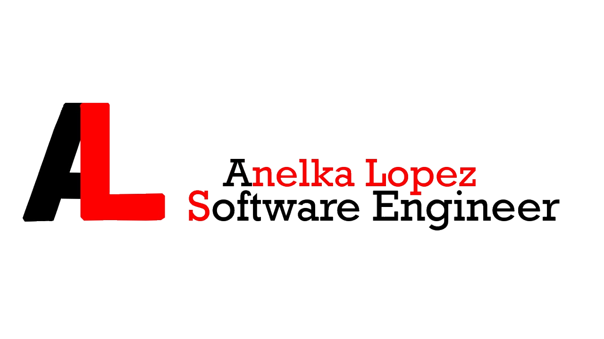

  

## Hey There!, My name is Anelka Lopez :computer:

I am an Information Technology student.  
I am very passionate about games and game developement.  
I also love to solve problems becuase to me, it's exciting.  

* :video_game: I am currently learning Game Development via Unity.
* :bar_chart: I am currently working on Database-based applications .
* :stars: I love coding because I get to express myself.
 
 

## Languages
* Learnt and using
  * Java (Intermediate) 
  * C/C++ (Novice) 
  * Python (Beginner) 
  * HTML/CSS (Beginner) 
 

* Learning
  * C# 
  * SQL
 
 

## GitHub Stats

 
 

## 	🤝🏿 Contact Me

